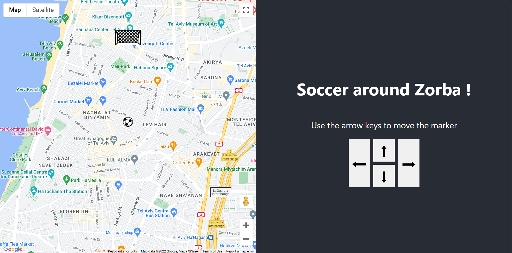

# Zorba Soccer game on Google Maps



## Demo video

A video presentation is available [here](https://youtu.be/0f-AmnzuHwo)

## How to run the game

1. You will need an API key for the Google Maps API. If you don't have one, you can get one [here](https://console.cloud.google.com/apis/credentials/key)

2. Clone this project, then run

```
cd back
npm run dev
```

Look at your console and write down the backend url and port

3. Create a .env file in the `front` folder and input these two pieces of information. A file called `.env.example` has been created to give you an example

## How to play

When the page loads, you are at the Mindspace Office in Tel-Aviv. The server will generate a random goal anywhere 1 kilometer away from you. 

Push the ball all the way there by using the buttons or your keyboard arrows.

When you are done, a victory message will appear.

### Stack used

- Back: Node.js, Express
- Frontend: React, Sass
- Third-party libraries: Turf, React Google Maps API
- Bundler: Vite